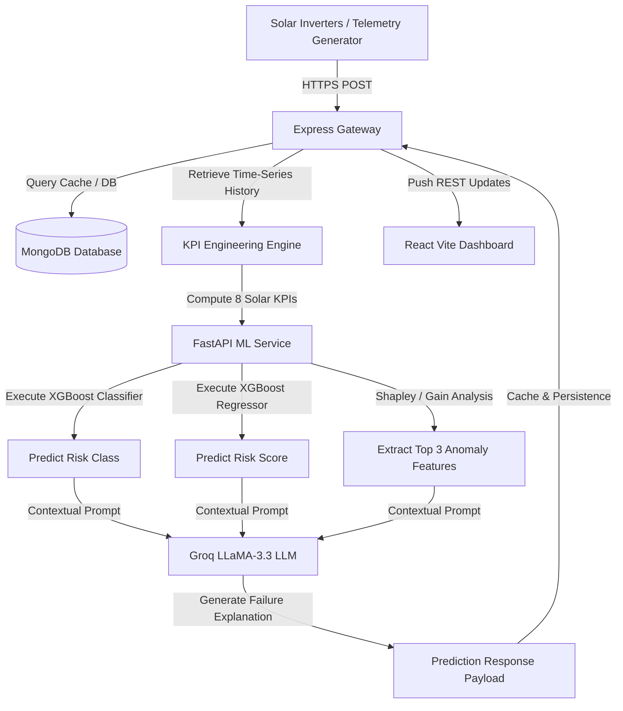

# SolarGuard AI — Smart Solar Inverter Failure Prediction & Explainable AI (XAI) Maintenance

<div align="center">

[](https://www.python.org/)
[](https://fastapi.tiangolo.com/)
[](https://react.dev/)
[](https://tailwindcss.com/)
[](https://nodejs.org/)
[](https://expressjs.com/)
[](https://www.mongodb.com/)
[](https://xgboost.readthedocs.io/)
[](https://groq.com/)
[](https://vitejs.dev/)

</div>

---

## 🌟 Executive Summary & Value Proposition

**SolarGuard AI** is an end-to-end, industrial-grade predictive maintenance and explainable AI (XAI) platform for solar power inverters. Inverters are the single most critical point of failure in solar generation. Unexpected downtime leads to severe revenue loss, high emergency repair costs, and grid instability.

SolarGuard AI solves this by engineering domain-specific solar KPIs from high-frequency string telemetry, feeding these into **XGBoost classification and regression models**, and generating natural language root-cause analyses using **LLaMA-3.3-70b-versatile** via **Groq**. 

### 🚀 Key Technical Highlights
- **Decoupled Microservice Architecture**: The CPU-intensive ML inference and LLM explainers run on a fast Python-based FastAPI microservice, leaving the core Node.js/Express API to handle high-throughput client connections and data persistence.
- **Explainable AI (XAI)**: Predictions are backed by Top-3 feature impact metrics (based on XGBoost feature gain weights), which are contextualized by an LLM to give engineers plain-English diagnostic explanations and maintenance instructions.
- **Stateful Telemetry Buffer**: The Express gateway maintains an active history cache (up to 288 steps, representing a rolling 24-hour window at 5-minute intervals) for each inverter to calculate dynamic, time-series KPIs on the fly.
- **Recruiter-Friendly Design**: Clean separation of concerns, structured MVC layout in backend, clean context state on frontend, and production-grade ML pipelines.

---

## 🗺️ System Architecture

The following diagram illustrates how telemetry data flows from edge inverters to the dashboard:



---

## ⚙️ Feature Engineering & Domain KPIs

Raw inverter telemetry (voltage, current, temperature) does not easily reveal complex degradation patterns. SolarGuard AI transforms raw readings into 8 vital physical KPIs to detect anomalies early:

| KPI Name | Description | Mathematical / Logical Formulation | Physical Significance in Solar Maintenance |
| :--- | :--- | :--- | :--- |
| **`efficiency`** | Conversion efficiency of the inverter | $P_{AC} / (V_{PV\_avg} \times I_{PV\_avg} + 10^{-6})$ | Mismatches between DC input and AC output detect power leakage, ground faults, or internal inverter heat losses. |
| **`power_drop`** | Instantaneous relative drop in output power | $(P_t - P_{t-1}) / P_{t-1}$ | Identifies sudden cloud cover, partial shading, trip-out events, or sudden component failures. |
| **`voltage_dev`** | Voltage deviation from historical baseline | $\| V_{PV\_avg, t} - \text{SMA}_{24h}(V_{PV\_avg}) \|$ | Detects string line-to-line faults, degradation of PV cells, or bypass diode failures. |
| **`current_dev`** | Current deviation from historical baseline | $\| I_{PV\_avg, t} - \text{SMA}_{24h}(I_{PV\_avg}) \|$ | Signals micro-cracks, module mismatch, dirt/soiling accumulation, or partial shading on strings. |
| **`voltage_imbalance`** | Standard deviation across PV string voltages | $\sqrt{ \frac{1}{M} \sum_{i=1}^M (V_{PV, i} - V_{PV\_avg})^2 }$ | Highlights mismatched panel counts, degradation in specific panels, or string connection damage. |
| **`current_imbalance`** | Standard deviation across PV string currents | $\sqrt{ \frac{1}{M} \sum_{i=1}^M (I_{PV, i} - I_{PV\_avg})^2 }$ | Detects string fuses blown, module mismatch, or severe localized dirt/soiling. |
| **`power_std_6h`** | Standard deviation of power output over 6 hours | $\text{StdDev}_{6h}(P_{AC})$ | Measures grid frequency synchronization stability and inverter output fluctuations. |
| **`efficiency_trend`** | 24-hour moving average conversion efficiency | $\text{SMA}_{24h}(\text{efficiency})$ | Reveals long-term hardware aging, dust accumulation, or cooling fan degradation. |

---

## 📂 Repository Structure

```directory
├── backend/                       # Core Node.js/Express REST API
│   ├── config/                    # DB connection configuration
│   ├── controllers/               # Express Controllers (Auth, Telemetry, Copilot, etc.)
│   ├── middleware/                # JWT Auth & Global Error Handlers
│   ├── models/                    # Mongoose Models (Plant, Inverter, Telemetry, Prediction)
│   ├── routes/                    # Express Router Endpoints
│   ├── utils/                     # KPI Calculator & ML client interfaces
│   ├── migrateRiskLevels.js       # Database migration utility
│   ├── server.js                  # Main Express Server
│   └── package.json
│
├── frontend/                      # React 19 Frontend Web Client
│   ├── public/                    # Static Assets
│   ├── src/
│   │   ├── api/                   # Axios HTTP requests
│   │   ├── components/            # Reusable UI components (Sidebar, Forms, Risk Gauges)
│   │   ├── context/               # Global Context API for Auth and Inverter details
│   │   ├── pages/                 # High-Fidelity UI Dashboards & Input Screens
│   │   ├── App.jsx                # React Router setup (v7)
│   │   └── main.jsx
│   ├── vite.config.js             # Vite Dev Config
│   └── package.json
│
├── ml_service/                    # FastAPI Machine Learning Microservice
│   ├── app.py                     # FastAPI Application entry point
│   ├── llm_explainer.py           # Groq LLaMA 3.3 Integration
│   ├── main_risk_classifier.pkl   # Trained XGBoost Classifier model
│   ├── main_risk_regressor.pkl    # Trained XGBoost Regressor model
│   ├── main_label_encoder.pkl     # Pickle file for class label encoder
│   └── requirements.txt
│
└── [Root Python Scripts]          # Offline ML Data Prep & Training Pipeline
    ├── run_full_pipeline.py       # Orchestrates the raw CSV flattening, KPI engineering, and inference
    ├── main_model_training.py     # Performs Hyperparameter tuning (GridSearchCV) & saves models
    ├── preprocessing.py           # Raw telemetry cleaning & feature engineering utilities
    ├── dataset_builder.py         # Labeled training dataset generation
    └── config.py                  # Telemetry parameters and configurations
```

---

## ⚙️ Installation & Local Setup

To set up and run SolarGuard AI locally, you need to spin up the three primary modules: the **Python ML service**, the **Express server**, and the **Vite-React UI**.

### 1. Prerequisite Environments
Ensure you have the following installed on your machine:
- Node.js (v18+)
- Python (v3.10+)
- MongoDB Community Server (or MongoDB Atlas account)

---

### 2. Machine Learning Service Setup & Model Training
First, prepare the Python environment and train the models.

```bash
# Clone the repository
git clone https://github.com/Ayush-pra/HackMind_SolarGaurd.git
cd HackMind_SolarGaurd

# Set up a virtual environment (optional but recommended)
python -m venv venv
venv\Scripts\activate      # Windows

# Install pipeline and service requirements
pip install -r ml_service/requirements.txt
# Additional root requirements if needed: pip install scikit-learn joblib matplotlib pandas numpy xgboost
```

#### Run the Offline pipeline
The pipeline loads raw telemetry logs (e.g., `plant_1.csv`, `plant_2.csv`), flattens inverter data, computes KPIs, and saves `final_trainable_dataset.csv`.
```bash
python run_full_pipeline.py
```

#### Train the XGBoost Models
Run the training script to perform hyperparameter tuning (randomized stratified search) and serialize the models.
```bash
python main_model_training.py
```
This produces three files in the root folder: `main_risk_classifier.pkl`, `main_risk_regressor.pkl`, and `main_label_encoder.pkl`. Copy these three files into the `ml_service/` directory.

#### Start the FastAPI Microservice
Ensure you create `ml_service/.env` with your Groq API key:
```env
LLM_API_KEY=gsk_your_groq_api_key_here
```
Run the service:
```bash
cd ml_service
uvicorn app:app --host 0.0.0.0 --port 8000
```
FastAPI runs on **`http://localhost:8000`**.

---

### 3. Node.js Express Backend Setup
Open a new terminal window:
```bash
cd backend
npm install
```

Create a `.env` file in the `backend/` directory:
```env
PORT=5000
MONGO_URI=mongodb://127.0.0.1:27017/solarguard
JWT_SECRET=your_jwt_secret_key_here
GROQ_API_KEY=gsk_your_groq_api_key_here
ML_SERVICE_URL=http://localhost:8000
```

Start the backend application:
```bash
# For development (includes automatic nodemon reloading)
npm run dev

# For production
npm start
```
The server will start listening on **`http://localhost:5000`**.

*(Optional)* If you have legacy database records and want to migrate their health categories to align with the new machine learning models, run the database migration tool:
```bash
node migrateRiskLevels.js
```

---

### 4. React Frontend Web Setup
Open a third terminal window:
```bash
cd frontend
npm install
```

Create a `.env` file in the `frontend/` directory:
```env
VITE_API_URL=http://localhost:5000
```

Start the UI web client:
```bash
npm run dev
```
Open your browser and navigate to **`http://localhost:5173`**.

---

## 🔌 API Endpoints Reference

### 1. Express Backend Gateway (`http://localhost:5000`)

| Method | Endpoint | Description | Auth Required |
| :--- | :--- | :--- | :---: |
| `POST` | `/api/auth/signup` | Register a new user | ❌ |
| `POST` | `/api/auth/login` | Authenticate user & return JWT token | ❌ |
| `GET` | `/api/plants` | Fetch all registered solar power plants | 🔒 |
| `POST` | `/api/plants` | Register a new solar plant | 🔒 |
| `GET` | `/api/plants/:plantId/inverters` | Fetch all inverters under a specific plant | 🔒 |
| `GET` | `/api/inverters` | Get all inverters | 🔒 |
| `GET` | `/api/inverters/:inverterId` | Get detailed meta details of a single inverter | 🔒 |
| `POST` | `/api/telemetry` | Post new real-time inverter metrics (Triggers ML & updates DB) | 🔒 |
| `POST` | `/api/copilot/ask` | Send questions to LLaMA 3.3 Copilot for context-aware answers | 🔒 |

### 2. FastAPI ML Service (`http://localhost:8000`)

| Method | Endpoint | Request Body | Response Payload |
| :--- | :--- | :--- | :--- |
| `POST` | `/predict` | Telemetry input features | Class labels (`No Risk`, `Degradation Risk`, `Shutdown Risk`), Risk Score (0-100), Top-3 SHAP features, and an LLM failure summary. |
| `GET` | `/health` | None | Returns ML loading and health statuses (`healthy` / `unhealthy`). |
| `GET` | `/models` | None | Returns information about active classifiers, regressors, and target feature labels. |

---

## 🚀 Machine Learning & Explainable AI Details

### XGBoost Classifier Performance
- **Accuracy**: `99%`
- **F1 Score**: `0.99` (No Risk), `0.99` (Degradation Risk), `0.95` (Shutdown Risk)
- **Target Classes**:
  - `No Risk` (Active, healthy operation)
  - `Degradation Risk` (Voltage/current anomalies, early temperature warning)
  - `Shutdown Risk` (Imbalance threshold violations, urgent shutdown risk)

### XGBoost Regressor Performance
- **Mean Absolute Error (MAE)**: `4.96` (Scale of 0-100)
- **R² Score**: `0.87`

### Root-Cause Diagnostics
When a prediction returns, XGBoost extracts the feature importances for the inference run. The top metrics (e.g., `voltage_imbalance = 12.8`, `temp = 89°C`) are paired with a system prompt and dispatched to **LLaMA 3.3**. The model output generates concise root-cause diagnostics:
> **Example AI Output:** "The inverter exhibits a significant voltage imbalance of 12.8V, coupled with internal temperatures exceeding normal parameters. This suggests a potential breakdown in PV String 3 bypass diodes or connection degradation. **Recommendation:** Dispatch technician to inspect String 3 connections within 48 hours."

---

## 👥 Team & Authors

This project was built during the **HackMind** Hackathon.

| Name | Role | Email | University | Grad Year |
| :--- | :--- | :--- | :--- | :---: |
| **Ayush Prajapati** (Leader) | Full Stack & ML Engineer | ayushprajapati15806@gmail.com | Nirma University | 2027 |
| **Mannkumar Prajapati** | Frontend & Analytics Lead | mannprajapati0284@gmail.com | Nirma University | 2027 |
| **Vivek Prajapati** | Backend & Database Architect | prajapativivek93165@gmail.com | Nirma University | 2027 |
| **Tirth Patel** | UI/UX & Data Analyst | tirthpatel9606@gmail.com | Nirma University | 2027 |
| **Vishv Sheta** | DevOps & Cloud Integration | vishv1511@gmail.com | Nirma University | 2027 |
